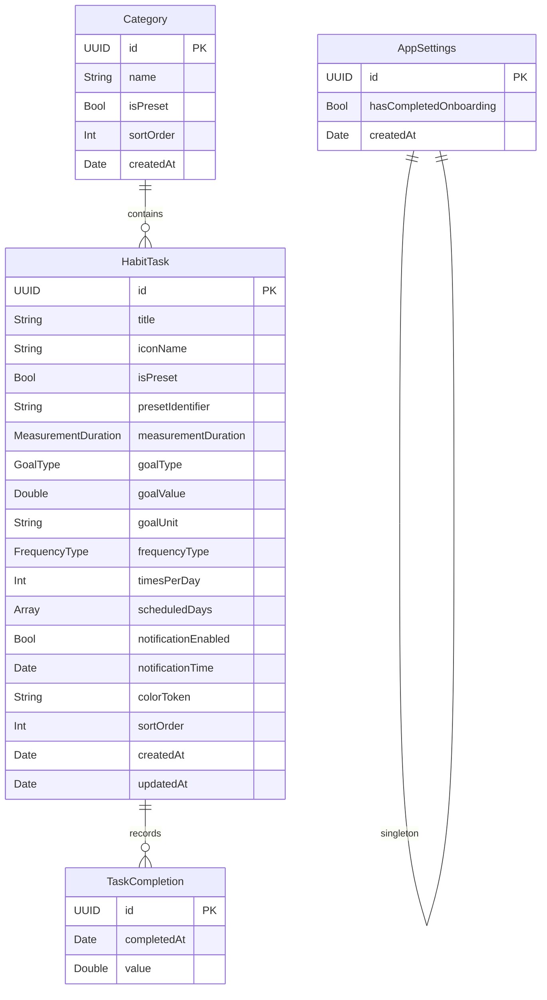

# Data Model

> SwiftData entity definitions for the Habit Tracker iOS app.
> Derived from the functional requirements in [prd.md](prd.md).

---

## 1. Entity-Relationship Diagram

---

## 2. Entities

### 2.1 Category

Represents a grouping label for tasks. Four preset categories are seeded on first launch; users can create additional custom categories.

**Source:** FR-2 (task list category dropdown), FR-3 (task category assignment), FR-x (new task selector tabs).

| Field       | Type     | Required | Default        | Description |
| ----------- | -------- | -------- | -------------- | ----------- |
| `id`        | `UUID`   | Yes      | auto-generated | Primary key |
| `name`      | `String` | Yes      | --             | Display name (e.g., "Fitness", "My Goals") |
| `isPreset`  | `Bool`   | Yes      | `false`        | `true` for the four built-in categories; prevents user deletion |
| `sortOrder` | `Int`    | Yes      | 0              | Position in category lists and tab bars |
| `createdAt` | `Date`   | Yes      | now            | Timestamp of creation |

**Relationships:**

| Relationship | Target      | Cardinality | Delete Rule |
| ------------ | ----------- | ----------- | ----------- |
| `tasks`      | `HabitTask` | One-to-Many | Nullify (orphaned tasks become uncategorized) |

**Seed data (created on first launch):**

| name       | isPreset | sortOrder |
| ---------- | -------- | --------- |
| Health     | true     | 0         |
| Fitness    | true     | 1         |
| Learning   | true     | 2         |
| Social     | true     | 3         |

---

### 2.2 HabitTask

The core entity representing a habit the user wants to track. Created from either a preset selection or a custom task flow.

**Source:** FR-1 (tap-and-hold completion), FR-3 (task configuration), FR-7 (task menu).

| Field                 | Type                  | Required | Default        | Description |
| --------------------- | --------------------- | -------- | -------------- | ----------- |
| `id`                  | `UUID`                | Yes      | auto-generated | Primary key |
| `title`               | `String`              | Yes      | --             | User-visible task name (e.g., "Meditate", "Run") |
| `iconName`            | `String?`             | No       | `nil`          | SF Symbol name. When `nil`, the UI renders the first 2 initials of `title` (UX principles section 5) |
| `isPreset`            | `Bool`                | Yes      | `false`        | `true` if the task was created from the preset catalog |
| `presetIdentifier`    | `String?`             | No       | `nil`          | Stable key linking back to the preset catalog entry (e.g., `"fitness.run"`) |
| `measurementDuration` | `MeasurementDuration` | Yes      | `.daily`       | Period length for goal evaluation: daily, weekly, or monthly |
| `goalType`            | `GoalType`            | Yes      | `.none`        | What the user is measuring (see enum below) |
| `goalValue`           | `Double?`             | No       | `nil`          | Target amount (e.g., 5.0 for 5 km). `nil` when `goalType == .none` |
| `goalUnit`            | `String?`             | No       | `nil`          | Display unit string (e.g., `"km"`, `"min"`, `"cups"`). `nil` when `goalType == .none` |
| `frequencyType`       | `FrequencyType`       | Yes      | `.daily`       | Whether the task recurs every day or on specific weekdays |
| `timesPerDay`         | `Int`                 | Yes      | 1              | Number of times per day the task should be completed. Relevant when `frequencyType == .daily` |
| `scheduledDays`       | `[Int]`               | Yes      | `[1,2,3,4,5,6,7]` | ISO 8601 weekday numbers (1 = Monday ... 7 = Sunday). Relevant when `frequencyType == .specificDays`. Stored as JSON-encoded array in SwiftData |
| `notificationEnabled` | `Bool`                | Yes      | `false`        | Whether a local push notification is scheduled for this task |
| `notificationTime`    | `Date?`               | No       | `nil`          | Time-of-day component for the reminder. Only the hour/minute are meaningful. `nil` when `notificationEnabled == false` |
| `colorToken`          | `String`              | Yes      | `"blue"`       | Identifier into the app's curated palette of 12--16 accent colors (UX principles section 4) |
| `sortOrder`           | `Int`                 | Yes      | 0              | Position in the task list grid |
| `createdAt`           | `Date`                | Yes      | now            | Timestamp of creation |
| `updatedAt`           | `Date`                | Yes      | now            | Timestamp of last modification |

**Relationships:**

| Relationship  | Target           | Cardinality | Delete Rule |
| ------------- | ---------------- | ----------- | ----------- |
| `category`    | `Category`       | Many-to-One | Nullify     |
| `completions` | `TaskCompletion` | One-to-Many | Cascade (deleting a task removes all its completions) |

---

### 2.3 TaskCompletion

Records a single completion event for a task. One row is inserted each time the user successfully completes the tap-and-hold gesture (FR-1). All statistics (FR-4) and streak calculations are derived from these records.

**Source:** FR-1 (tap-and-hold completion), FR-4 (task stats), FR-5 (manage task completions).

| Field         | Type      | Required | Default        | Description |
| ------------- | --------- | -------- | -------------- | ----------- |
| `id`          | `UUID`    | Yes      | auto-generated | Primary key |
| `completedAt` | `Date`    | Yes      | now            | Full timestamp of the completion event |
| `value`       | `Double?` | No       | `nil`          | Actual achieved value for goal-based tasks (e.g., 3.2 km, 25 minutes). `nil` for tasks with `goalType == .none` |

**Relationships:**

| Relationship | Target      | Cardinality | Delete Rule |
| ------------ | ----------- | ----------- | ----------- |
| `task`       | `HabitTask` | Many-to-One | Nullify     |

---

### 2.4 AppSettings (singleton)

A single-row entity storing global application state. Created on first launch.

**Source:** User journey 4.2 (onboarding flow).

| Field                    | Type   | Required | Default        | Description |
| ------------------------ | ------ | -------- | -------------- | ----------- |
| `id`                     | `UUID` | Yes      | auto-generated | Primary key |
| `hasCompletedOnboarding` | `Bool` | Yes      | `false`        | Flipped to `true` when the user finishes the onboarding flow |
| `createdAt`              | `Date` | Yes      | now            | Timestamp of first launch |

---

## 3. Enums

All enums are defined as Swift `String`-backed enums and stored as raw string values in SwiftData.

### 3.1 MeasurementDuration

The time period over which a task's goal is evaluated.

| Case      | Raw Value   | Description |
| --------- | ----------- | ----------- |
| `daily`   | `"daily"`   | Goal resets every day |
| `weekly`  | `"weekly"`  | Goal resets every week |
| `monthly` | `"monthly"` | Goal resets every month |

### 3.2 GoalType

What the user is measuring for this task.

| Case          | Raw Value        | Compatible Units | Description |
| ------------- | ---------------- | ---------------- | ----------- |
| `none`        | `"none"`         | --               | Simple completion (tap to mark done) |
| `repetitions` | `"repetitions"`  | times            | Count-based (e.g., push-ups) |
| `time`        | `"time"`         | sec, min, hr     | Duration-based (e.g., meditate 10 min) |
| `cups`        | `"cups"`         | cups             | Drink tracking (e.g., water intake) |
| `calories`    | `"calories"`     | kcal             | Calorie tracking |
| `distance`    | `"distance"`     | m, km, mi        | Distance-based (e.g., run 5 km) |
| `weight`      | `"weight"`       | g, kg, lb        | Weight-based |
| `capacity`    | `"capacity"`     | mL, L            | Volume-based (e.g., water in liters) |

### 3.3 FrequencyType

How often the task recurs.

| Case           | Raw Value          | Description |
| -------------- | ------------------ | ----------- |
| `daily`        | `"daily"`          | Every day; `timesPerDay` controls repetitions per day |
| `specificDays` | `"specificDays"`   | Only on selected weekdays defined in `scheduledDays` |

### 3.4 Weekday

ISO 8601 weekday identifiers used in the `scheduledDays` array.

| Case      | Int Value | Description |
| --------- | --------- | ----------- |
| `monday`  | 1         | Monday      |
| `tuesday` | 2         | Tuesday     |
| `wednesday` | 3       | Wednesday   |
| `thursday`  | 4       | Thursday    |
| `friday`    | 5       | Friday      |
| `saturday`  | 6       | Saturday    |
| `sunday`    | 7       | Sunday      |

---

## 4. Preset Task Catalog (reference data -- not persisted)

The 20 preset tasks from FR-x are defined as a static Swift array in code. They are **not** stored in SwiftData. When a user selects a preset, a new `HabitTask` entity is created with fields pre-filled from the catalog entry. The user can modify any pre-filled value (per FR-3 and acceptance criteria).

| Identifier                  | Name                     | Category | Default GoalType | Default Unit |
| --------------------------- | ------------------------ | -------- | ---------------- | ------------ |
| `fitness.walk`              | Walk                     | Fitness  | `distance`       | km           |
| `fitness.run`               | Run                      | Fitness  | `distance`       | km           |
| `fitness.bike`              | Bike                     | Fitness  | `distance`       | km           |
| `fitness.pushups`           | Push ups                 | Fitness  | `repetitions`    | times        |
| `fitness.pullups`           | Pull ups                 | Fitness  | `repetitions`    | times        |
| `fitness.gym`               | Gym                      | Fitness  | `time`           | min          |
| `fitness.swim`              | Swim                     | Fitness  | `time`           | min          |
| `health.meditate`           | Meditate                 | Health   | `time`           | min          |
| `health.healthyMeal`        | Eat a healthy meal       | Health   | `none`           | --           |
| `health.journal`            | Write journal            | Health   | `time`           | min          |
| `health.walkDog`            | Walk the dog             | Health   | `time`           | min          |
| `health.vitamins`           | Take vitamins            | Health   | `none`           | --           |
| `health.drinkWater`         | Drink water              | Health   | `cups`           | cups         |
| `health.decreaseCaffeine`   | Decrease caffeine        | Health   | `cups`           | cups         |
| `health.decreaseCalories`   | Decrease calories intake | Health   | `calories`       | kcal         |
| `health.dontSmoke`          | Don't smoke              | Health   | `none`           | --           |
| `health.dontBiteNails`      | Don't bite nails         | Health   | `none`           | --           |
| `health.daylight`           | Time in daylight         | Health   | `time`           | min          |
| `health.bedTimeEarly`       | Bed time early           | Health   | `none`           | --           |
| `health.washHands`          | Wash hands               | Health   | `none`           | --           |
| `social.callParents`        | Call parents             | Social   | `time`           | min          |
| `social.callFriend`         | Call a friend            | Social   | `time`           | min          |
| `social.askFriendOut`       | Ask a friend out         | Social   | `none`           | --           |
| `social.kissPartner`        | Kiss partner             | Social   | `none`           | --           |
| `learning.learnLanguage`    | Learn a language         | Learning | `time`           | min          |

---

## 5. Computed Properties (not persisted)

The following values are derived at runtime from `TaskCompletion` records. They are **not** stored in the database to avoid data duplication and stale-data bugs.

### 5.1 Streak

A **streak** is the count of consecutive measurement periods (days, weeks, or months -- matching `measurementDuration`) in which the task has at least one completion. The current streak starts from the most recent completed period and counts backwards without gaps.

**Algorithm outline:**

1. Query completions for the task, ordered by `completedAt` descending.
2. Bucket completions into periods based on `measurementDuration` (calendar day / ISO week / calendar month).
3. Starting from the current (or most recent completed) period, count consecutive non-empty periods backwards.

### 5.2 Statistics (FR-4)

All task stats are computed by querying `TaskCompletion` records within the selected time window (default: last 30 days, per FR-4):

- **Completion count:** `COUNT(completions)` where `completedAt` is within the window.
- **Completion percentage:** completions achieved / completions expected (based on `frequencyType`, `timesPerDay`, and `scheduledDays` within the window).
- **Trend line data:** completions aggregated into 7-day buckets when the window is < 60 days, or monthly buckets when >= 60 days (FR-4).

---

## 6. Relationship & Delete Rules Summary

| Parent         | Child            | Cardinality | On Parent Delete | On Child Delete |
| -------------- | ---------------- | ----------- | ---------------- | --------------- |
| `Category`     | `HabitTask`      | 1 : N       | Nullify (tasks become uncategorized) | No effect |
| `HabitTask`    | `TaskCompletion` | 1 : N       | Cascade (completions are deleted)     | No effect |

---

## 7. Notification Scheduling (runtime, not persisted)

Notification state is managed at runtime by `UNUserNotificationCenter`, not stored in the database. The `HabitTask` fields `notificationEnabled` and `notificationTime` serve as the source of truth for scheduling:

- When a task is saved with `notificationEnabled == true`, a local notification is scheduled for each applicable day based on `frequencyType`, `scheduledDays`, and `notificationTime`.
- When a task is completed before the scheduled notification time, the pending notification for that day is cancelled (FR-6, acceptance criteria).
- When a task is edited or deleted, its pending notifications are cancelled and re-scheduled (if still enabled).

---

## 8. Disk Budget Analysis

Per PRD success criteria (section 2): < 10 MB on-device data for a typical user (50 tasks, 1 year of completions).

| Data                        | Estimate     | Calculation |
| --------------------------- | ------------ | ----------- |
| 50 `HabitTask` rows         | ~25 KB       | ~500 bytes/row (strings + dates + relationships) |
| 4-10 `Category` rows        | < 1 KB       | ~100 bytes/row |
| 18,250 `TaskCompletion` rows | ~900 KB     | 50 tasks x 365 days x ~50 bytes/row |
| 1 `AppSettings` row         | < 1 KB       | Singleton |
| SQLite overhead + indexes   | ~100 KB      | Indexes on `completedAt`, foreign keys |
| **Total**                   | **~1 MB**    | Well within the 10 MB constraint |
