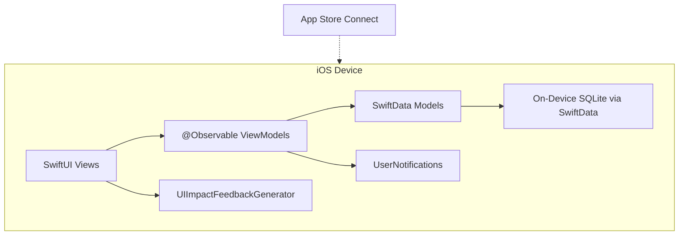

# Technical Stack Recommendation for Habit Tracker

## Recommended Stack

### Frontend: **SwiftUI** (iOS 17+)

SwiftUI is the clear winner here for several reasons:

- **Native gesture system** -- FR-1 (tap-and-hold with animated progress ring + haptic) maps directly to SwiftUI's `.onLongPressGesture` and `withAnimation`. No bridging or workaround needed.
- **Smooth, "catching" UI** -- SwiftUI delivers 60fps animations, native transitions, and platform-consistent behavior out of the box.
- **App Store readiness** -- No binary bloat from bundled runtimes (React Native ~7MB, Flutter ~5MB overhead). Smaller binary = faster review, better user perception.
- **Zero dependency for core features** -- Push notifications (`UserNotifications`), haptics (`UIImpactFeedbackGenerator`), SF Symbols for icons, and `Charts` framework are all first-party Apple APIs.
- **Minimum iOS 17** gives access to the latest SwiftUI navigation, animation, and observation APIs while still covering ~95% of active iPhones.

### Backend: **None**

The PRD explicitly rules out API services, authentication, and cloud storage. All logic runs on-device.

### Database: **SwiftData**

- Apple's modern persistence framework (successor to Core Data), available from iOS 17.
- Declarative `@Model` macros integrate cleanly with SwiftUI's `@Query` property wrapper -- less boilerplate than Core Data.
- Handles the data model entities (Tasks, Categories, Completions, Settings) with relationships, migrations, and background context support.
- All data stays on-device, aligning with the no-cloud constraint.

### Hosting / Cloud: **None (App Store distribution only)**

No server infrastructure. The only deployment target is the Apple App Store via Xcode + App Store Connect.

### Charts: **Swift Charts** (Apple framework, iOS 16+)

- FR-4 requires trend line charts (completions over time, 7-day and monthly frequency).
- Swift Charts is native, declarative, and integrates with SwiftUI without third-party dependencies.

### Notifications: **UserNotifications framework**

- FR-6 requires configurable push notifications with time-of-day scheduling and conditional suppression if the task is already completed.
- `UNUserNotificationCenter` handles local scheduled notifications natively -- no server-side push infrastructure needed.

### Icons: **SF Symbols**

- The PRD requires a "multitude of available icons" for task configuration (FR-3).
- SF Symbols provides 5,000+ icons, is free, requires no asset bundling, and adapts to Dynamic Type and accessibility settings automatically.

### Test Framework: **Swift Testing + XCTest**

- **Swift Testing** (new `@Test` macro-based framework): for unit and integration tests of data models, business logic, and task completion rules.
- **XCTest / XCUITest**: for UI automation tests (e.g., verifying the long-press gesture completes a task, onboarding flow, navigation).

### Architecture: **MVVM with SwiftUI Observation**

- `@Observable` view models (iOS 17) keep views reactive and testable.
- Clear separation: **Model** (SwiftData entities) / **ViewModel** (business logic, formatting) / **View** (SwiftUI screens).
- No need for heavy architecture (VIPER, TCA) given the app's scope.

---

## Why NOT React Native or Flutter?

The PRD mentions "AI code generation" as a goal, which could favor JS/TS ecosystems. However:


| Concern                                    | Native SwiftUI                              | React Native / Flutter                |
| ------------------------------------------ | ------------------------------------------- | ------------------------------------- |
| Long-press + animated ring + haptic (FR-1) | 5 lines of native code                      | Requires bridge modules or plugins    |
| App Store binary size                      | ~5-10 MB                                    | +5-7 MB runtime overhead              |
| Push notification scheduling (FR-6)        | Direct API access                           | Plugin wrappers with version lag      |
| Chart library (FR-4)                       | Apple Swift Charts, zero deps               | Third-party (Victory, fl_chart)       |
| Native polish                             | First-party APIs, pixel-perfect             | Close but never pixel-identical       |
| AI code generation                         | Xcode + Copilot/Cursor support SwiftUI well | Slightly more training data for JS/TS |


The marginal AI-generation advantage of JS/TS does not outweigh the native experience advantages for an iOS-only App Store product.

---

## Proposed Section 7.2 Update

Fill section 7.2 of [docs/prd.md](docs/prd.md) with:

```markdown
### 7.2 Technical Stack
- Frontend: SwiftUI (iOS 17+)
- Backend: None (local-only, no API services)
- Database: SwiftData (on-device persistence)
- Hosting / Cloud: None (Apple App Store distribution via Xcode / App Store Connect)
- Charts: Swift Charts (Apple framework)
- Notifications: UserNotifications (local scheduled notifications)
- Icons: SF Symbols
- Architecture: MVVM with @Observable
- Test framework: Swift Testing (unit/integration) + XCUITest (UI automation)
```

---

## High-Level Architecture




